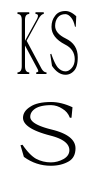

Khitan Small Stacked is a PUA-encoded Khitan Small Script font based on
[BabelStone Khitan Small Glyphs](http://www.babelstone.co.uk/Fonts/Khitan.html).
It is a proof of concept of the CGJ-based encoding proposed in
[L2/18-121](https://www.unicode.org/L2/L2018/18121-n4943-khitan-cluster.pdf)
using OpenType to stack glyphs into clusters of unbounded length.
Only vertical clusters embedded in horizontal text are supported,
but a true vertical font would follow most of the same principles.

Each Khitan Small Script character has six glyph variants:

* the nominal glyph, not in a cluster
* the initial glyph of a cluster, spanning the entire row (`kss1init`)
* the initial glyph of a cluster on the left side of the row (`kss2init`)
* the final glyph of a cluster, spanning the entire row (`kss1`)
* a non-initial glyph on the left side of the row (`kss2`)
* a non-initial glyph on the right side of the row (`kss3`)

The first three are base glyphs and the last three are mark glyphs.

The main logic happens in two contextual chaining substitution lookups.
```AFDKO
feature ccmp {
    substitute [@kss1init @kss1 @kss2init] @kss' lookup kss1;
    substitute @kss' lookup kss1init uni034F' @kss;
    substitute @kss' lookup kss2init @kss;
} ccmp;

feature ccmp {
    substitute [@kss2init @kss2] @kss1' lookup kss3;
    substitute @kss1' lookup kss2 @kss1;
} ccmp;
```
Any two adjacent nominal glyphs must be in the same cluster,
so the first lookup converts any initial nominal glyph to its `kss1init` or `kss2init` form,
depending on whether U+034F COMBINING GRAPHEME JOINER follows,
and any trailing nominal glyphs to `kss1`.
The second lookup corrects those `kss1` glyphs to `kss2` or `kss3`
depending on the context.

Two more lookups attach the marks to bases and other marks in the usual way.

When a multi-row cluster is embedded in horizontal text,
the extra rows should go above the line,
so a contextual chaining position lookup raises `kss1init` and `kss2init` glyphs
depending on how many glyphs follow them in the same cluster.
It only handles up to four rows,
but it would be simple to extend it if a longer cluster were ever needed.
